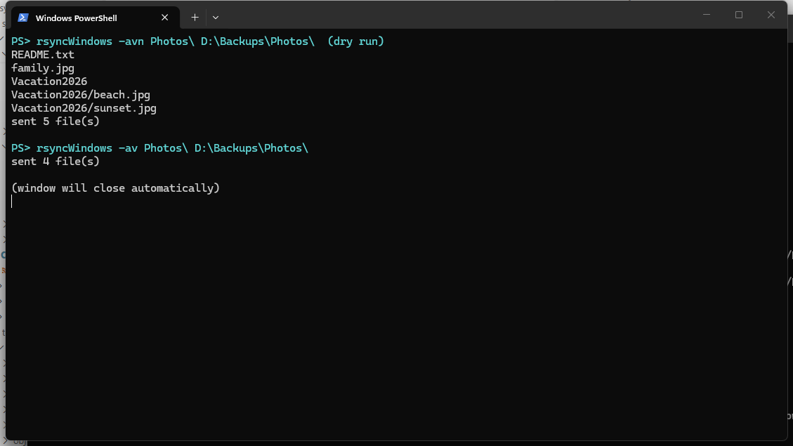
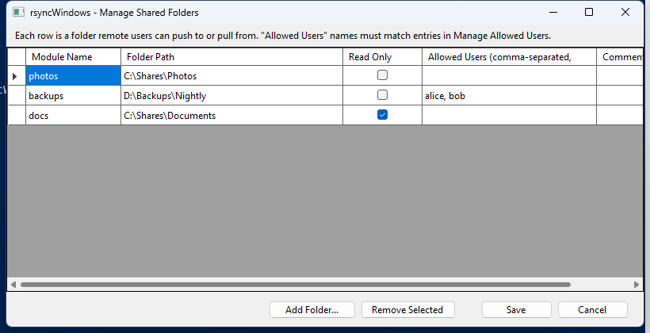
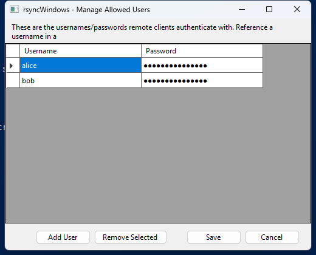

# rsyncWindows

A ground-up, protocol-compatible reimplementation of `rsync` for Windows — a client
(`rsyncWindows.exe`), a daemon that runs as a genuine Windows Service, and a system-tray app for
managing it. It speaks real rsync's wire protocol (protocol version 32, the same one rsync 3.x
uses), so it interoperates directly with genuine `rsync` installs on Linux/macOS, as well as with
other rsyncWindows installs — no separate agent or SFTP bridge required.

## Features

- **Client**: push/pull files over SSH or rsync's own daemon protocol (`rsync://host/module`) —
  works against genuine Linux/macOS `rsync` installs, other rsyncWindows installs, or another
  Windows machine running `rsyncWindows` behind OpenSSH Server
- **Server**: a Windows Service exposing named folders ("modules") to the network, just like a
  real `rsyncd` — per-module read-only/read-write, host allow/deny lists, and optional
  username/password authentication
- **Tray app**: live service status, start/stop, and GUI editors for shared folders and
  authorized users — no hand-editing config files required; config changes hot-reload in about a
  second, no service restart
- **Delta-transfer**: only the changed blocks of a modified file cross the wire, not the whole
  file, using the same rolling-checksum algorithm as real rsync
- **Compression** (`-z`): real zlib under the hood, compatible with a genuine rsync peer's `-z`
- **Real interactive SSH authentication**: password prompts and host-key confirmations appear
  and work normally in your terminal — no need to pre-configure SSH keys just to get started
  (though keys are still recommended for unattended/scripted transfers)
- **Real-time progress**: `-v` prints each file's path as its transfer begins, not just a
  one-line summary at the end
- Owner/group and permission fields on the wire, timestamp preservation, symlink recreation,
  filename-pattern excludes/includes, dry-run preview (`-n`), and more — see
  [Command-line options](#command-line-options) below
- Licensed under the Apache License, Version 2.0 (see [License](#license) below)

## Screenshots

**Client CLI** — dry-run preview, then a real transfer:



**Tray app — Manage Shared Folders** (which local folders are exposed, and to whom):



**Tray app — Manage Allowed Users** (who can authenticate to a protected folder):



## Install

From an **elevated** PowerShell prompt:

```powershell
cd dist
.\install.ps1
```

This installs the client to `C:\Program Files\rsyncWindows\cli` (and adds it to the machine
`PATH`), registers the daemon as a Windows Service (`rsyncWindows`, auto-start), opens an inbound
firewall rule for it (port 873 by default), and starts the tray app (which also registers itself
to auto-start at login). Open a **new** terminal afterward so the updated `PATH` takes effect:

```powershell
rsyncWindows --version
```

To remove everything: `dist\uninstall.ps1` (also elevated). Full installer options (custom
install path, custom port, skipping the service/firewall/PATH steps) are documented in
[`dist/docs/README.md`](dist/docs/README.md).

## Quick usage examples

`-a` (archive: recursive + preserve permissions/times/etc.) and `-v` (verbose) are the two flags
you'll use almost always. A **trailing slash** on the source means "copy the folder's *contents*"
— without it, the folder itself is created at the destination too.

**Copy a local folder to another local folder:**

```powershell
rsyncWindows -av "C:\Users\me\Documents\Photos\" "D:\Backups\Photos\"
```

**Push a folder to a Linux server over SSH:**

```powershell
rsyncWindows -av "C:\Projects\myapp\" user@192.0.2.10:/home/user/myapp/
```

If the server needs a password (or this is the first time connecting and needs a host-key
confirmation), Windows' OpenSSH client prompts for it right in the same terminal, same as running
`ssh` directly — no extra setup required, though SSH keys are still recommended for unattended
transfers.

If the server uses a non-standard SSH port, pass it through `-e`/`--rsh` (this is exactly how
real `rsync` does it too — there's no separate `--port` flag for SSH mode):

```powershell
rsyncWindows -av -e "ssh -p 2222" "C:\Projects\myapp\" user@192.0.2.10:/home/user/myapp/
```

**Pull a folder down from a Linux server:**

```powershell
rsyncWindows -av user@192.0.2.10:/home/user/myapp/ "C:\Projects\myapp\"
```

**Compress data in transit** (worthwhile on slow links, e.g. text-heavy source trees):

```powershell
rsyncWindows -avz "C:\Projects\myapp\" user@192.0.2.10:/home/user/myapp/
```

**Preview what would transfer, without changing anything** (`-n` = dry run):

```powershell
rsyncWindows -avn "C:\Projects\myapp\" user@192.0.2.10:/home/user/myapp/
```

**Push to another Windows machine running rsyncWindows** — same syntax, just needs OpenSSH
Server enabled on the remote Windows box, plus `--rsync-path` so the remote side knows which
binary to run:

```powershell
rsyncWindows -av --rsync-path=rsyncWindows "C:\Projects\myapp\" user@192.168.1.50:C:/Projects/myapp/
```

**Talk to an rsync daemon module directly** (no SSH — the target has an `rsyncd`-style daemon
listening, e.g. a rsyncWindows or real-rsync daemon with a module named `backups`):

```powershell
rsyncWindows -av "C:\Projects\myapp\" rsync://192.0.2.10/backups/myapp/
```

Protected (password-authenticated) modules take a username in the URL and a password file
(never pass a real password on the command line):

```powershell
rsyncWindows -av --password-file=C:\secure\rsync.pass "C:\Projects\myapp\" rsync://alice@192.0.2.10/backups/
```

**Check the version and license:**

```powershell
rsyncWindows --version
```

## Command-line options

```
rsyncWindows [OPTION]... SRC DEST
```

`SRC`/`DEST` can each be a local path, `user@host:/path` or `host:/path` (SSH), `host::module/path`
(daemon protocol, default port 873), or `rsync://host[:port]/module/path` (daemon, explicit URL
form) — exactly one side may be remote.

| Option | Short | Effect |
|---|---|---|
| `--verbose` | `-v` | Print each file's path as its transfer begins |
| `--dry-run` | `-n` | Show what would transfer, change nothing |
| `--archive` | `-a` | Shorthand for `-rlptgoD` |
| `--recursive` | `-r` | Recurse into directories |
| `--links` | `-l` | Recreate symlinks at the destination (best-effort — see [`dist/docs/README.md`](dist/docs/README.md) for the Windows-specific caveats) |
| `--perms` | `-p` | Apply best-effort permissions (owner-write bit ↔ Windows ReadOnly attribute) |
| `--times` | `-t` | Preserve modification times |
| `--owner` | `-o` | Include uid on the wire (no Windows-user mapping applied on write) |
| `--group` | `-g` | Include gid on the wire (no Windows-group mapping applied on write) |
| `--devices`, `--specials`, `-D` | | Recognized; device/special files are not created on Windows |
| `--compress` | `-z` | Compress file data in transit (real zlib) |
| `--compress-level=N` | | Zlib compression level |
| `--checksum` | `-c` | Parsed, not yet enforced (always uses block checksums) |
| `--exclude=PATTERN`, `--include=PATTERN` | | Filter which files are sent (`*`, `**`, `?`, `/`-anchoring) |
| `--human-readable` | `-h` | Recognized |
| `--itemize-changes` | `-i` | Recognized |
| `--rsh=COMMAND` | `-e` | Remote shell to use (default `ssh`) — e.g. `-e "ssh -p 2222"` for a non-default port |
| `--rsync-path=PATH` | | What to execute on the remote end (default `rsync`; use `rsyncWindows` for a Windows remote) |
| `--password-file=PATH` | | Daemon-mode (`rsync://`) auth: read the password from this file instead of prompting/env |
| `--stats` | | Recognized |
| `--version` | `-V` | Print version, author, and license info |

**Parsed but not yet acted on** (accepted so scripts don't fail argument parsing, but have no
effect yet): `--exclude-from`/`--include-from` (read `--exclude`/`--include` directly for now),
`--filter`/`-f`, `--delete` and its timing variants, `--update`, `--existing`,
`--ignore-existing`, `--relative`, `--files-from`, `--backup`/`--backup-dir`, `--bwlimit`,
`--partial`/`--partial-dir`/`-P`, `--progress`, `--out-format`, `--log-file`.

The full reference — including server/daemon config file format, module options, and
troubleshooting — is in [`dist/docs/README.md`](dist/docs/README.md).

## Setting up your own server

1. Install (above) — the daemon starts automatically as a Windows Service.
2. Right-click the tray icon (in the notification area — check the hidden-icons overflow arrow
   if you don't see it) → **Manage Shared Folders...** to expose a folder. Give it a module
   name and a path; leave "Allowed Users" blank for open access, or list usernames to require
   authentication.
3. If you listed any allowed users, → **Manage Allowed Users...** to set their passwords.
4. Changes take effect within about a second — no service restart needed.
5. From another machine: `rsync rsync://your-windows-host/` lists available modules.

Both editors prompt for administrator rights when opened (they edit the daemon's config and
credentials store), even though the tray icon itself runs without elevation.

## How it compares

Unlike wrapping WSL's `rsync` or shelling out to a bundled Cygwin binary, rsyncWindows is a
native Windows console/service app with no POSIX emulation layer — the daemon runs as a normal
Windows Service, and the client is a normal `.exe` on your `PATH`.

## Building from source

```powershell
dotnet build RsyncWindows.slnx -c Release
dotnet test test\RsyncWindows.Core.Tests\RsyncWindows.Core.Tests.csproj -c Release
```

`test/RsyncWindows.Interop.Tests` additionally validates against a real `rsync` binary over
WSL2 — see that project's own doc comments for the one-time WSL setup it expects; it's skipped
automatically if that environment isn't present.

To rebuild the self-contained binaries under `dist/bin/`:

```powershell
dotnet publish src\RsyncWindows.Cli\RsyncWindows.Cli.csproj -c Release -r win-x64 --self-contained true -o dist\bin\cli
dotnet publish src\RsyncWindows.Service\RsyncWindows.Service.csproj -c Release -r win-x64 --self-contained true -o dist\bin\service
dotnet publish src\RsyncWindows.Tray\RsyncWindows.Tray.csproj -c Release -r win-x64 --self-contained true -o dist\bin\tray
```

## Project layout

```
src/            .NET source (Core = protocol/wire logic, Cli, Service, Tray, Transports)
test/           Unit tests + real-rsync interop tests
tools/          Diagnostic utilities used during development (WSL bridge scripts, icon generator)
assets/         Application icon source
dist/           Ready-to-run distribution: install.ps1, uninstall.ps1, docs/, and dist/bin/
                (self-contained published binaries for cli/service/tray -- no separate .NET
                install needed on the target machine)
```

## License

Copyright 2026 Jose Rodriguez Arroyo. Licensed under the **Apache License, Version 2.0** — see
[`LICENSE`](LICENSE) for the full text, or <http://www.apache.org/licenses/LICENSE-2.0>.

## Author

Jose Rodriguez Arroyo
Email: jrpcone@gmail.com
GitHub: [@jorodriguezpr](https://github.com/jorodriguezpr)
